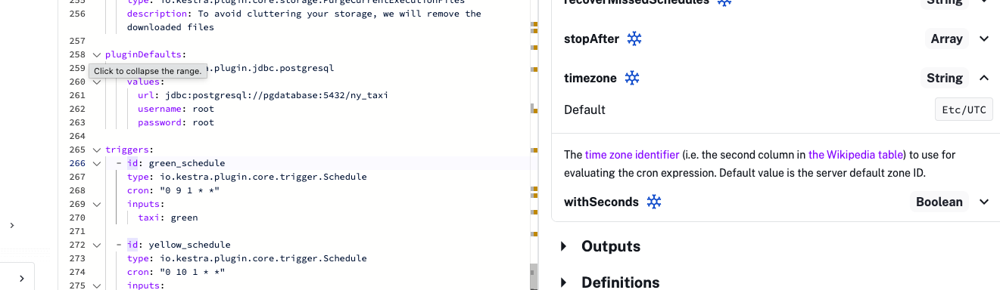

# Workflow Orchestration and Data Lake Ingestion with Kestra

This project expands the data platform by introducing workflow orchestration and data lake ingestion. The goal is to automate the extraction, transformation, and loading of NYC Taxi data using Kestra while extending the pipeline to support an additional year of historical data.

This stage focuses on turning manual steps into repeatable, scheduled workflows and validating the pipeline through real execution metrics.

## From Manual Pipelines to Orchestrated Workflows

In real data platforms, pipelines must run automatically, recover from failures, and scale across time ranges. Workflow orchestration tools solve this by managing scheduling, dependencies, retries, logging, and backfills.

Kestra is used in this project to orchestrate ingestion of NYC Taxi datasets into PostgreSQL and a data lake. The existing workflows handled 2019 and 2020. They were extended to include **2021 data** using Kestra’s scheduling and backfill capabilities.

Kestra allows two approaches:
- Backfilling historical periods using scheduled workflows
- Programmatically looping through year, month, and taxi-type combinations using `ForEach` and `Subflow`

This demonstrates how orchestration removes the need for manual reruns when new historical data becomes available.

## Inspecting Extract Task Output Size

Understanding intermediate file sizes is important for estimating storage and network costs in ETL pipelines.

To inspect the uncompressed file size produced by the extract task, the workflow was modified to include:

```yaml
- id: extract
  type: io.kestra.plugin.scripts.shell.Commands
  outputFiles:
    - "*.csv"
  taskRunner:
    type: io.kestra.plugin.core.runner.Process
  commands:
    - wget -qO- https://github.com/DataTalksClub/nyc-tlc-data/releases/download/{{inputs.taxi}}/{{render(vars.file)}}.gz | gunzip > {{render(vars.file)}}
    - ls -lh {{render(vars.file)}}
```

For **Yellow Taxi December 2020**, the uncompressed CSV size was:

**128.3 MiB**

This highlights how compressed public datasets expand significantly during processing, which impacts storage planning.

## Parameterization and Dynamic Filenames

Kestra workflows rely heavily on variables and templating. This enables the same workflow to process different datasets without duplicating code.

The filename variable is defined as:

```yaml
variables:
  file: "{{inputs.taxi}}_tripdata_{{trigger.date | date('yyyy-MM')}}.csv"
```

During execution with:
- taxi = green
- year = 2020
- month = 04

The rendered value becomes:

`green_tripdata_2020-04.csv`

This demonstrates how templating allows pipelines to dynamically generate file paths based on runtime parameters.

## Validating Pipeline Loads with SQL

Once orchestrated workflows ingest data into PostgreSQL, validating row counts ensures the pipeline ran successfully across all months.

### Total Yellow Taxi rows for 2020

```sql
SELECT COUNT(*) 
  FROM public.yellow_tripdata
 WHERE filename LIKE '%2020%' ;
```

Result:

**24,648,499 rows**

### Total Green Taxi rows for 2020

```sql
SELECT COUNT(*)
  FROM public.green_tripdata
 WHERE filename LIKE '%2020%' ;
```

Result:

**1,734,051 rows**

Comparing yearly totals is a common validation technique for pipeline completeness.

### Yellow Taxi rows for March 2021

After extending the workflow to process 2021 data, the March dataset was validated:

```sql
SELECT COUNT(*)
  FROM public.yellow_tripdata
 WHERE filename LIKE '%2021-03%' ;
```

Result:

**1,925,152 rows**

This confirms the extended pipeline successfully processed new historical data.

## Scheduling Workflows in the Correct Timezone

Scheduling is critical in production data pipelines. Running jobs in the wrong timezone can break SLAs and downstream dashboards.

Kestra uses the IANA timezone database for scheduling. To run workflows in New York time, the Schedule trigger was configured as:

```yaml
triggers:
  - id: green_schedule
    type: io.kestra.plugin.core.trigger.Schedule
    cron: "0 9 1 * *"
    timezone: America/New_York
    inputs:
        taxi: green
```

The correct configuration is:

**timezone: America/New_York**

Using the IANA timezone ensures proper daylight saving time handling.

